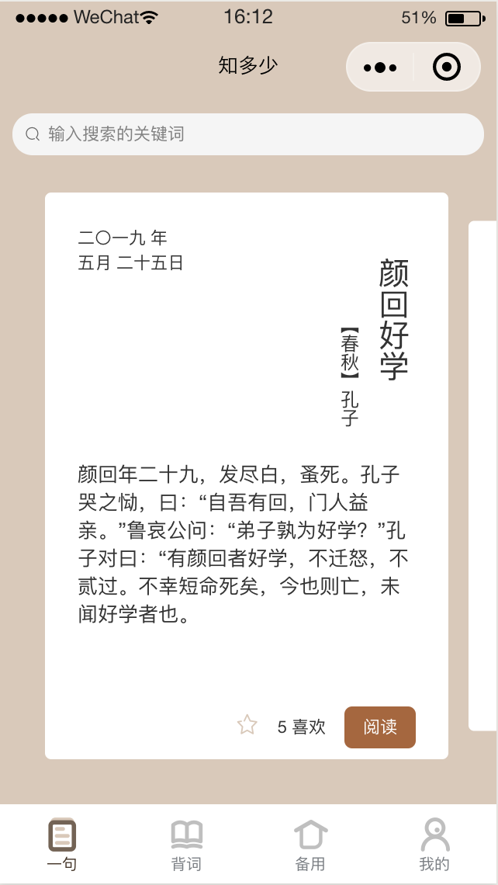
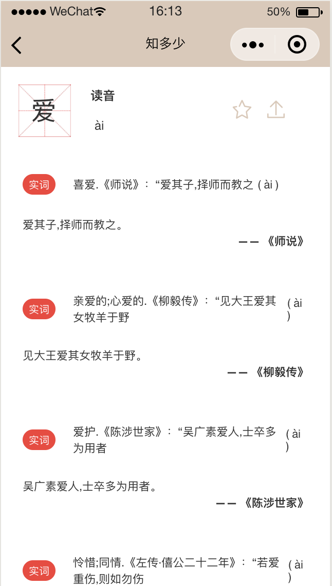
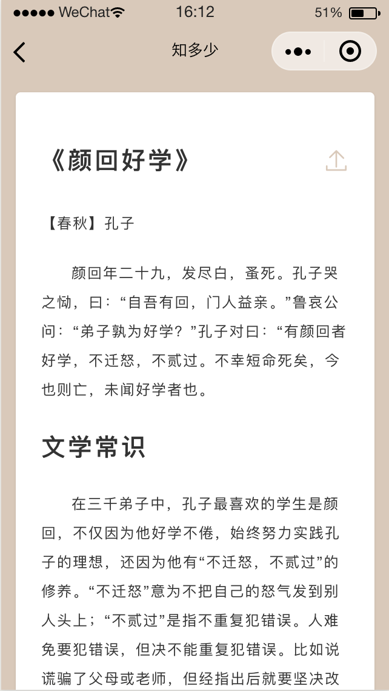
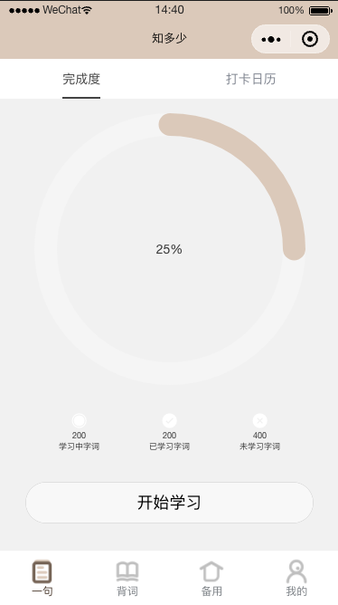
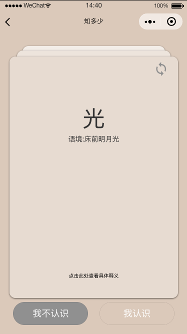
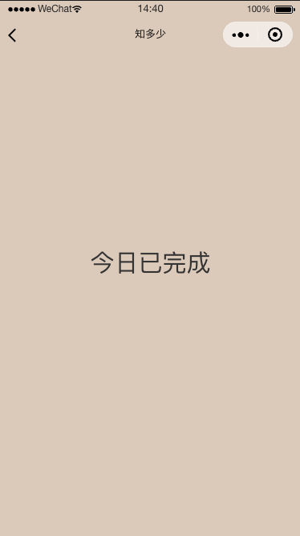
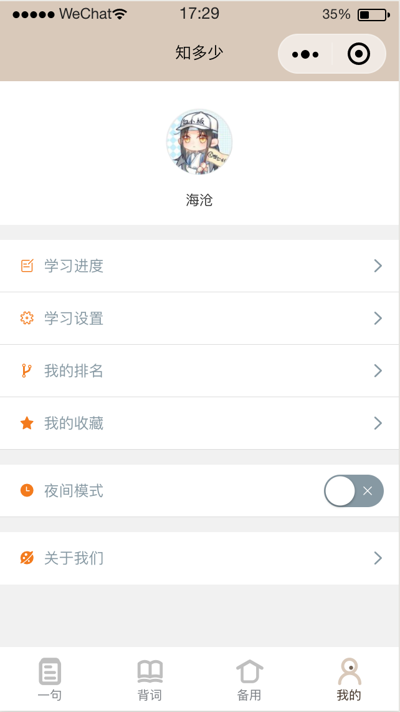
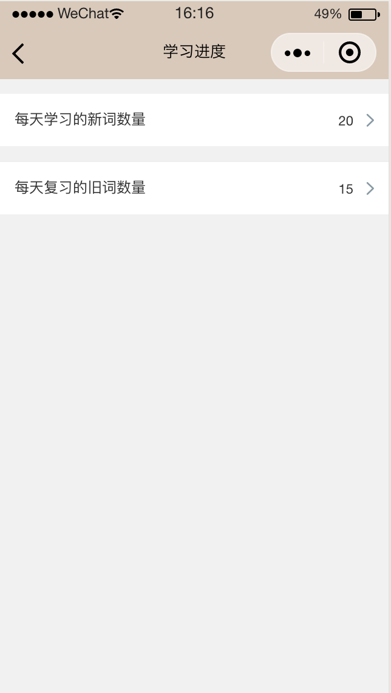
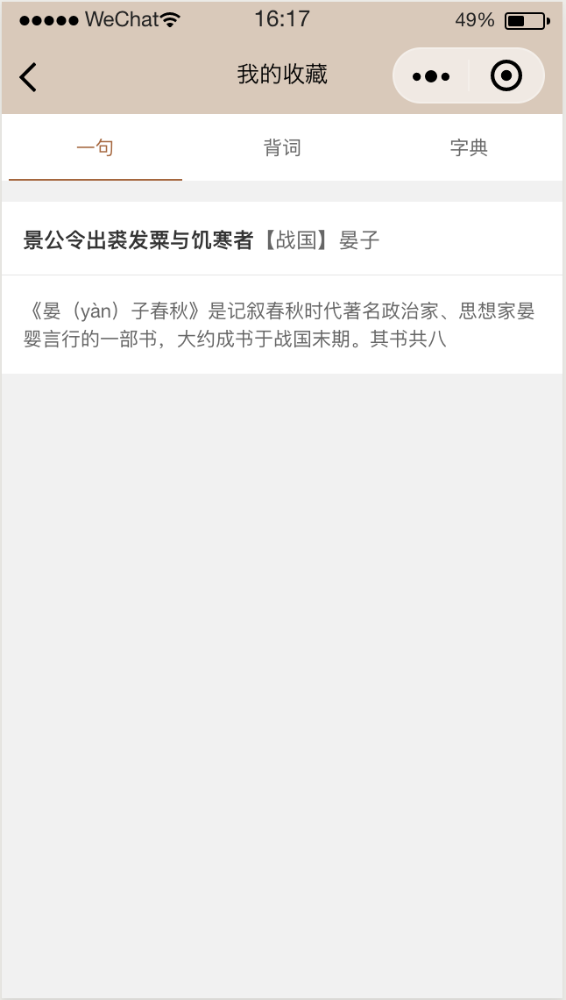

# 知多少

一个帮助中小学生学习古文的微信小程序

## 项目地址

项目介绍 https://fdu-sw.github.io

前端 https://github.com/zyz9740/SEapp

后端 https://github.com/bernardshen/ZhiDuoShaoApi

## 前端介绍

### "一句"页面

这个页面整合了查词和每日一句的功能。"每日一句"即每天给用户推送一篇课外短文，

打开小程序，首页如下；可以看到如下页面。可以点击星号收藏当前按钮，可以左右滑动来切换不同的卡片，也可以点击"阅读"来详细查看某篇文章

  

    
     
    <em>首页：一句</em>
  

上方的输入框是查词的按钮，例如输入"爱"就会进入下面这个页面；可以看到

  

    
     
    <em>查词</em>
  

而在首页点击"阅读"，则会进入某一篇文章的阅读页面，如下

  

    
     
    <em>查词</em>
  

### "背词"页面

	

    
     
    <em>背词主页面</em>
  
  

该页面提供了一些当前的学习进度，以及开始学习的按钮。

	

    
     
    <em>背词界面</em>
  
  

背词以卡片的形势呈现，左滑动卡片为"我不认识"， 右划卡片为"我认识"

	

    
     
    <em>背词完成界面</em>
  
  

背词完成后会显示今日背词已完成

### "我的"页面

该页面提供了一些设置和信息，上方显示的是该用户的微信头像

  

    
     
    <em>我的</em>
  

"学习进度"里是用户过去一周的学习数据（每天学习了多少词汇）

"学习设置"里可以设置用户每天学习的新词数量和复习的旧词数量，如下图

  

    
     
    <em>设置</em>
  

"收藏"页面如下，点击对应的框可以跳转到对应的页面，可以通过左右滑动屏幕来切换不同的栏目

  

    
     
    <em>收藏</em>
  

